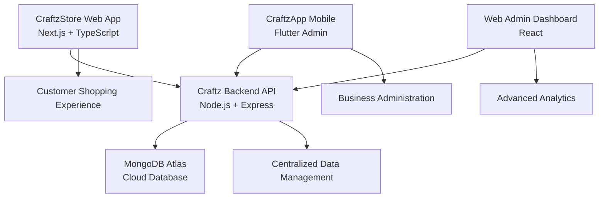

<p align="center">
  
  
  
  
  
  
</p>

<h1 align="center">🛍️ CraftzStore - E-commerce Web Platform</h1>
<h3 align="center">Modern, high-performance online store for custom clothing and personalized products</h3>

<p align="center">
  <em>Next.js 15 • Server-Side Rendering • TypeScript • Tailwind CSS • Framer Motion</em>
</p>

---

## 🌐 Platform Overview

**CraftzStore** is a cutting-edge e-commerce web application built with Next.js 15, serving as the customer-facing storefront for the Craftz custom clothing business. The platform delivers a seamless shopping experience with modern web technologies, server-side rendering, and responsive design.

### Core E-commerce Features
- 🛒 **Advanced Product Catalog** with dynamic filtering and search
- 🎨 **Custom Product Designer** for personalized clothing
- 🔍 **Intelligent Search** with category and price filtering
- 📱 **Responsive Design** optimized for all devices
- 🌍 **Internationalization** with multi-language support
- 🚀 **Performance Optimized** with Next.js App Router
- 🔐 **Secure Authentication** with JWT integration
- 💳 **Payment Integration** ready for multiple gateways
- 📊 **SEO Optimized** with structured data and meta tags

### Business Capabilities
- **Product Customization:** Real-time design preview and customization
- **Inventory Integration:** Live stock levels from backend API
- **Order Management:** Seamless checkout and order tracking
- **Customer Accounts:** User registration, login, and profile management
- **Admin Interface:** Product management and order administration
- **Analytics Ready:** Google Analytics and conversion tracking
- **Marketing Tools:** SEO optimization and social media integration

---

## 🛠️ Technology Stack

### Frontend Framework
| Technology | Version | Purpose | Implementation |
|------------|---------|---------|----------------|
| **Next.js** | 15.3.3 | React Framework | App Router, SSR, Static Generation |
| **React** | 19.0 | UI Library | Server Components, Concurrent Features |
| **TypeScript** | 5.0+ | Type Safety | Full type coverage, strict mode |

### Styling & UI
| Technology | Purpose | Features |
|------------|---------|----------|
| **Tailwind CSS** | Utility-first CSS | Responsive design, custom components |
| **Framer Motion** | Animation Library | Smooth transitions, interactive animations |
| **Heroicons** | Icon System | Consistent, scalable SVG icons |

### Form Management & Validation
| Package | Implementation | Benefits |
|---------|----------------|----------|
| **React Hook Form** | Form State Management | Performance, minimal re-renders |
| **Zod** | Schema Validation | Type-safe validation, error handling |
| **@hookform/resolvers** | Form Integration | Seamless validation integration |

### User Experience
| Technology | Purpose | Enhancement |
|------------|---------|-------------|
| **React Hot Toast** | Notifications | User feedback, success/error messages |
| **Next-Intl** | Internationalization | Multi-language support |
| **Structured Data** | SEO Enhancement | Rich snippets, search optimization |

### Development & Build
| Tool | Purpose | Configuration |
|------|---------|---------------|
| **ESLint** | Code Quality | Next.js optimized rules |
| **Turbopack** | Build Tool | Fast development builds |
| **PostCSS** | CSS Processing | Tailwind CSS integration |

---

## 🏗️ Application Architecture

### Next.js App Router Structure
```
src/
├── app/
│   ├── (auth)/                 # Authentication routes
│   │   ├── login/
│   │   ├── register/
│   │   └── account/
│   ├── (marketing)/            # Marketing pages
│   │   ├── about/
│   │   ├── contact/
│   │   ├── privacy-policy/
│   │   └── terminos-y-condiciones/
│   ├── (shop)/                 # E-commerce functionality
│   │   ├── products/
│   │   ├── cart/
│   │   └── checkout/
│   ├── admin/                  # Admin interface
│   ├── layout.tsx              # Root layout
│   ├── page.tsx                # Homepage
│   └── not-found.tsx           # 404 page
├── components/                 # Reusable components
│   ├── auth/
│   ├── home-page/
│   ├── navbar/
│   ├── products/
│   └── admin/
├── contexts/                   # React contexts
├── hooks/                      # Custom hooks
├── lib/                        # Utilities and API
├── styles/                     # Global styles
└── types/                      # TypeScript definitions
```

### Component Architecture
```typescript
// Product Component Example
interface ProductCardProps {
  product: ProductoOnline;
  onAddToCart?: (product: ProductoOnline) => void;
  showQuickView?: boolean;
}

export function ProductCard({ product, onAddToCart, showQuickView }: ProductCardProps) {
  return (
    <motion.div
      whileHover={{ scale: 1.02 }}
      className="group relative overflow-hidden rounded-lg bg-white shadow-md"
    >
      <div className="aspect-square overflow-hidden">
        <Image
          src={product.imagenes[0]?.url}
          alt={product.nombre}
          className="h-full w-full object-cover transition-transform group-hover:scale-105"
        />
      </div>
      <div className="p-4">
        <h3 className="text-lg font-semibold text-gray-900">{product.nombre}</h3>
        <p className="text-sm text-gray-600">{product.descripcionCorta}</p>
        <div className="mt-2 flex items-center justify-between">
          <span className="text-xl font-bold text-primary">
            ${product.precioMinimo} - ${product.precioMaximo}
          </span>
          {onAddToCart && (
            <Button onClick={() => onAddToCart(product)}>
              Agregar al Carrito
            </Button>
          )}
        </div>
      </div>
    </motion.div>
  );
}
```

---

## 🌐 API Integration & Data Management

### Backend Communication
The store integrates with the **[Craftz Backend API](../AplicacionCraftzApp_suarez)** for all data operations:

```typescript
// API Service Implementation
class ApiService {
  private baseURL = process.env.NEXT_PUBLIC_API_URL || 'http://localhost:5001';
  
  async getProductos(params?: ProductSearchParams): Promise<ProductResponse> {
    const searchParams = new URLSearchParams();
    if (params) {
      Object.entries(params).forEach(([key, value]) => {
        if (value !== undefined) {
          searchParams.append(key, value.toString());
        }
      });
    }
    
    const response = await fetch(`${this.baseURL}/store/productos?${searchParams}`, {
      headers: {
        'Content-Type': 'application/json',
        ...(this.getAuthHeaders()),
      },
    });
    
    if (!response.ok) {
      throw new Error(`API Error: ${response.status}`);
    }
    
    return response.json();
  }
  
  async getProductoBySlug(slug: string): Promise<ProductoOnline> {
    const response = await fetch(`${this.baseURL}/store/productos/${slug}`);
    return response.json();
  }
}
```

### Data Types & Models
```typescript
// Product Type Definitions
export interface ProductoOnline {
  _id: string;
  slug: string;
  nombre: string;
  descripcionCorta?: string;
  descripcion: string;
  precioMinimo: number;
  precioMaximo: number;
  diseno: string;
  imagenes: Array<{
    url: string;
    esPrincipal: boolean;
    orden: number;
  }>;
  productoBase: ProductoBase;
  varianteSugerida: {
    corte: string;
    calidad: string;
    color: string;
    talla?: string;
  };
  configColor: {
    colorFijo: boolean;
    colorRequerido?: string;
  };
  categorias: Array<{ _id: string; nombre: string }>;
  etiquetas: string[];
  activo: boolean;
  destacado: boolean;
}

export interface ProductoBase {
  _id: string;
  nombre: string;
  descripcion: string;
  categoria: { _id: string; nombre: string };
  subcategoria: { _id: string; nombre: string; usaTallas: boolean };
  configVariantes: {
    usaVariante: boolean;
    usaCalidad: boolean;
  };
  variantes: Variante[];
  imagenes: Array<{
    url: string;
    esPrincipal: boolean;
    orden: number;
  }>;
  activo: boolean;
}
```

### State Management
```typescript
// Authentication Context
'use client';

interface AuthContextType {
  user: User | null;
  login: (email: string, password: string) => Promise<void>;
  logout: () => void;
  isLoading: boolean;
}

export const AuthContext = createContext<AuthContextType | undefined>(undefined);

export function AuthProvider({ children }: { children: React.ReactNode }) {
  const [user, setUser] = useState<User | null>(null);
  const [isLoading, setIsLoading] = useState(true);
  
  useEffect(() => {
    const token = localStorage.getItem('auth_token');
    if (token) {
      verifyToken(token).then(setUser).catch(() => {
        localStorage.removeItem('auth_token');
      });
    }
    setIsLoading(false);
  }, []);
  
  const login = async (email: string, password: string) => {
    const response = await apiService.login(email, password);
    localStorage.setItem('auth_token', response.token);
    setUser(response.usuario);
  };
  
  return (
    <AuthContext.Provider value={{ user, login, logout, isLoading }}>
      {children}
    </AuthContext.Provider>
  );
}
```

---

## 🎨 User Interface & Design System

### Design Philosophy
- **Modern Minimalism:** Clean, uncluttered interface focusing on products
- **Mobile-First:** Responsive design optimized for all screen sizes
- **Performance-Focused:** Optimized images, lazy loading, and efficient rendering
- **Accessibility:** WCAG 2.1 compliant with keyboard navigation and screen reader support

### Component Library
```typescript
// Button Component with Variants
interface ButtonProps extends React.ButtonHTMLAttributes<HTMLButtonElement> {
  variant?: 'primary' | 'secondary' | 'outline' | 'ghost';
  size?: 'sm' | 'md' | 'lg';
  isLoading?: boolean;
}

export function Button({ 
  variant = 'primary', 
  size = 'md', 
  isLoading, 
  children, 
  className,
  ...props 
}: ButtonProps) {
  const baseClasses = 'inline-flex items-center justify-center rounded-md font-medium transition-colors focus-visible:outline-none focus-visible:ring-2 focus-visible:ring-ring disabled:pointer-events-none disabled:opacity-50';
  
  const variants = {
    primary: 'bg-primary text-primary-foreground hover:bg-primary/90',
    secondary: 'bg-secondary text-secondary-foreground hover:bg-secondary/80',
    outline: 'border border-input bg-background hover:bg-accent hover:text-accent-foreground',
    ghost: 'hover:bg-accent hover:text-accent-foreground',
  };
  
  const sizes = {
    sm: 'h-9 px-3 text-sm',
    md: 'h-10 px-4 py-2',
    lg: 'h-11 px-8 text-lg',
  };
  
  return (
    <button
      className={cn(baseClasses, variants[variant], sizes[size], className)}
      disabled={isLoading}
      {...props}
    >
      {isLoading && <Loader2 className="mr-2 h-4 w-4 animate-spin" />}
      {children}
    </button>
  );
}
```

### Animation System
```typescript
// Framer Motion Animations
export const fadeInUp = {
  initial: { opacity: 0, y: 20 },
  animate: { opacity: 1, y: 0 },
  transition: { duration: 0.5 }
};

export const staggerContainer = {
  animate: {
    transition: {
      staggerChildren: 0.1
    }
  }
};

// Usage in components
<motion.div
  variants={staggerContainer}
  initial="initial"
  animate="animate"
  className="grid grid-cols-1 md:grid-cols-2 lg:grid-cols-3 gap-6"
>
  {products.map((product) => (
    <motion.div key={product._id} variants={fadeInUp}>
      <ProductCard product={product} />
    </motion.div>
  ))}
</motion.div>
```

---

## 🛒 E-commerce Features

### Product Catalog
- **Dynamic Filtering:** Category, price range, color, size filters
- **Search Functionality:** Full-text search with autocomplete
- **Product Variants:** Size, color, and quality options
- **Image Gallery:** Multiple product images with zoom functionality
- **Stock Indicators:** Real-time availability status

### Shopping Cart & Checkout
```typescript
// Shopping Cart Hook
export function useCart() {
  const [items, setItems] = useState<CartItem[]>([]);
  
  const addItem = (product: ProductoOnline, variant: ProductVariant) => {
    setItems(prev => {
      const existingItem = prev.find(item => 
        item.product._id === product._id && 
        item.variant.id === variant.id
      );
      
      if (existingItem) {
        return prev.map(item =>
          item === existingItem
            ? { ...item, quantity: item.quantity + 1 }
            : item
        );
      }
      
      return [...prev, { product, variant, quantity: 1 }];
    });
  };
  
  const removeItem = (productId: string, variantId: string) => {
    setItems(prev => prev.filter(item => 
      !(item.product._id === productId && item.variant.id === variantId)
    ));
  };
  
  const total = items.reduce((sum, item) => 
    sum + (item.variant.price * item.quantity), 0
  );
  
  return { items, addItem, removeItem, total };
}
```

### Customer Features
- **User Registration & Login:** Secure authentication with JWT
- **Order History:** Complete purchase history and tracking
- **Wishlist:** Save favorite products for later
- **Product Reviews:** Customer feedback and ratings (planned)
- **Account Management:** Profile updates and preferences

---

## 🔍 SEO & Performance Optimization

### Search Engine Optimization
```typescript
// Structured Data for Products
export function ProductStructuredData({ product }: { product: ProductoOnline }) {
  const structuredData = {
    "@context": "https://schema.org",
    "@type": "Product",
    "name": product.nombre,
    "description": product.descripcion,
    "image": product.imagenes.map(img => img.url),
    "brand": {
      "@type": "Brand",
      "name": "Craftz"
    },
    "offers": {
      "@type": "AggregateOffer",
      "lowPrice": product.precioMinimo,
      "highPrice": product.precioMaximo,
      "priceCurrency": "MXN",
      "availability": "https://schema.org/InStock"
    }
  };
  
  return (
    <script
      type="application/ld+json"
      dangerouslySetInnerHTML={{ __html: JSON.stringify(structuredData) }}
    />
  );
}
```

### Performance Features
- **Image Optimization:** Next.js Image component with lazy loading
- **Code Splitting:** Automatic route-based code splitting
- **Static Generation:** Pre-rendered pages for better performance
- **Caching Strategy:** Efficient API response caching
- **Bundle Optimization:** Tree shaking and minification

### Core Web Vitals
- **LCP (Largest Contentful Paint):** < 2.5s
- **FID (First Input Delay):** < 100ms
- **CLS (Cumulative Layout Shift):** < 0.1
- **Performance Score:** 90+ on Lighthouse

---

## 🌍 Internationalization & Accessibility

### Multi-language Support
```typescript
// Next-Intl Configuration
import { getRequestConfig } from 'next-intl/server';

export default getRequestConfig(async ({ locale }) => ({
  messages: (await import(`../messages/${locale}.json`)).default
}));

// Usage in components
import { useTranslations } from 'next-intl';

export function ProductCard({ product }: { product: ProductoOnline }) {
  const t = useTranslations('products');
  
  return (
    <div>
      <h3>{product.nombre}</h3>
      <button>{t('addToCart')}</button>
    </div>
  );
}
```

### Accessibility Features
- **Keyboard Navigation:** Full keyboard accessibility
- **Screen Reader Support:** Proper ARIA labels and descriptions
- **Color Contrast:** WCAG AA compliant color ratios
- **Focus Management:** Visible focus indicators
- **Alternative Text:** Descriptive alt text for all images

---

## 🚀 Deployment & DevOps

### Build Configuration
```javascript
// next.config.ts
import type { NextConfig } from 'next';

const nextConfig: NextConfig = {
  experimental: {
    turbo: {
      rules: {
        '*.svg': {
          loaders: ['@svgr/webpack'],
          as: '*.js',
        },
      },
    },
  },
  images: {
    domains: ['res.cloudinary.com', 'images.unsplash.com'],
    formats: ['image/webp', 'image/avif'],
  },
  env: {
    NEXT_PUBLIC_API_URL: process.env.NEXT_PUBLIC_API_URL,
  },
};

export default nextConfig;
```

### Environment Configuration
```bash
# Production Environment Variables
NEXT_PUBLIC_API_URL=https://craftz-api.onrender.com
NEXT_PUBLIC_SITE_URL=https://craftzstore.com
NEXT_PUBLIC_GA_ID=G-XXXXXXXXXX
NEXTAUTH_SECRET=your-secret-key
NEXTAUTH_URL=https://craftzstore.com
```

### Performance Monitoring
- **Web Vitals:** Real User Monitoring (RUM)
- **Error Tracking:** Sentry integration (planned)
- **Analytics:** Google Analytics 4 integration
- **A/B Testing:** Feature flag implementation (planned)

---

## 🛣️ Development Roadmap

### ✅ Completed Features (v0.1.2)
- **Core E-commerce**
  - Product catalog with filtering and search
  - Shopping cart functionality
  - User authentication system
  - Responsive design implementation
  
- **Technical Foundation**
  - Next.js 15 App Router setup
  - TypeScript integration
  - Tailwind CSS styling system
  - API integration with backend
  
- **User Experience**
  - Smooth animations with Framer Motion
  - Form validation with React Hook Form + Zod
  - Toast notifications for user feedback
  - SEO optimization with structured data

### 🚧 In Development (v0.2.0)
- **Enhanced Shopping Experience**
  - Advanced product customization interface
  - Real-time inventory updates
  - Wishlist functionality
  - Product comparison feature
  
- **Payment Integration**
  - Stripe payment gateway
  - PayPal integration
  - Order confirmation system
  - Invoice generation
  
- **Performance Optimization**
  - Advanced caching strategies
  - Image optimization improvements
  - Bundle size optimization

### 📋 Planned Features (v1.0.0+)
- **Advanced E-commerce**
  - Customer reviews and ratings
  - Product recommendations
  - Advanced search with AI
  - Multi-currency support
  
- **Business Intelligence**
  - Customer analytics dashboard
  - Conversion tracking
  - A/B testing framework
  - Performance monitoring
  
- **Marketing Tools**
  - Email marketing integration
  - Social media sharing
  - Discount codes and promotions
  - Affiliate program support

---

## 🏗️ System Integration

### Multi-Platform Ecosystem
CraftzStore integrates seamlessly with the complete Craftz ecosystem:



### Data Flow Architecture
1. **Customer Interaction:** User browses products on CraftzStore
2. **API Communication:** Store fetches data from Craftz Backend API
3. **Real-time Updates:** Inventory changes reflect across all platforms
4. **Order Processing:** Orders created in store sync with admin systems
5. **Analytics:** Customer behavior tracked for business insights

### Communication Protocols
- **REST API:** HTTP/HTTPS communication with backend
- **JSON:** Structured data exchange format
- **JWT Authentication:** Secure user session management
- **WebSocket:** Real-time updates (planned)
- **GraphQL:** Advanced data fetching (planned)

---

## 📊 Business Impact & Metrics

### E-commerce Performance
- **Conversion Rate:** Target 3-5% industry standard
- **Average Order Value:** Optimized through product recommendations
- **Cart Abandonment:** Reduced through UX improvements
- **Customer Retention:** Enhanced through personalized experience

### Technical Performance
- **Page Load Speed:** < 3 seconds on 3G networks
- **Mobile Performance:** 90+ Lighthouse score
- **SEO Ranking:** Optimized for search engine visibility
- **Accessibility Score:** WCAG 2.1 AA compliance

### User Experience Metrics
- **User Engagement:** Time on site, pages per session
- **Customer Satisfaction:** User feedback and ratings
- **Mobile Usage:** Responsive design effectiveness
- **Search Functionality:** Search success rate and relevance

---

## 👨💻 Development Team

**Lead Developer:** Francisco García Solís  
**Frontend Architecture:** Next.js 15 + TypeScript specialist  
**UI/UX Design:** Modern e-commerce design patterns  
**Performance Optimization:** Core Web Vitals expert  
**SEO Implementation:** Technical SEO and structured data  

## 📎 Related Projects

| Project | Technology | Purpose | Integration |
|---------|------------|---------|-------------|
| **[Craftz Backend API](../AplicacionCraftzApp_suarez)** | Node.js, Express, MongoDB | Central API server | RESTful API consumption |
| **[CraftzApp Mobile](../craftzApp%20(Residencias))** | Flutter, Dart, Riverpod | Mobile admin interface | Shared inventory management |
| **Web Admin Dashboard** | React, Material-UI | Business administration | Parallel admin functionality |

## 🏆 Technical Achievements

- **Modern Web Standards:** Next.js 15 with App Router and Server Components
- **Type Safety:** Full TypeScript implementation with strict mode
- **Performance Excellence:** Optimized Core Web Vitals and Lighthouse scores
- **Responsive Design:** Mobile-first approach with Tailwind CSS
- **Animation Excellence:** Smooth, performant animations with Framer Motion
- **SEO Mastery:** Structured data, meta optimization, and search visibility
- **Accessibility Compliance:** WCAG 2.1 AA standards implementation

---

> **"Modern e-commerce excellence powered by Next.js 15 and cutting-edge web technologies"** 🛍️🚀
> 
> *TypeScript-driven, performance-optimized, customer-focused online shopping experience*